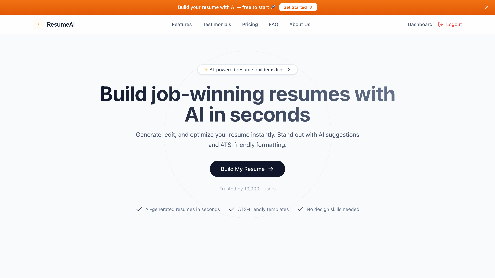
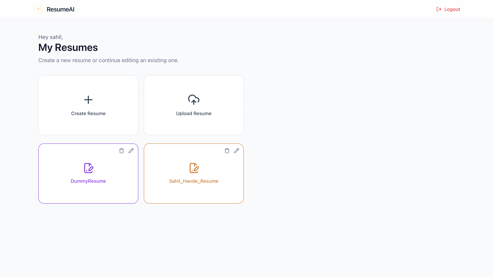
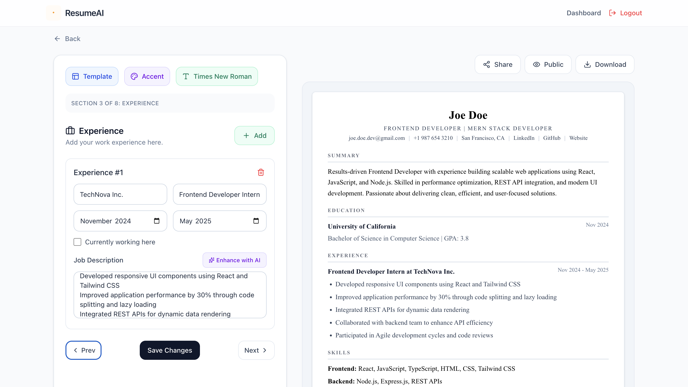
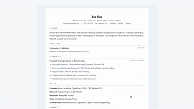

# ResumeAI

[](https://react.dev/)
[](https://expressjs.com/)
[](https://www.mongodb.com/)
[](https://ai.google.dev/)

A full-stack AI-powered resume builder built with the MERN stack. Users can sign up, generate and edit resumes, upload an existing PDF resume for AI-assisted extraction, switch between multiple templates, customize styling, and share public resume links.

## Overview

ResumeAI is a portfolio-grade MERN project focused on practical resume building rather than flashy UI alone. The core product flow is:

- authenticate a user
- create or import a resume
- edit content section by section
- preview changes live
- customize template, font, and color
- download or share the final resume

The project also includes AI-assisted content enhancement and a demo resume for every new user so the app is useful immediately after signup.

## Preview

### Home Page



### Dashboard



### Resume Builder



### Public Resume Preview



## Features

- JWT-based authentication with strong password validation
- Automatic demo resume created for every new user
- Resume builder with live preview and step-by-step editing flow
- Multiple resume templates, including ATS-focused layouts
- Font and accent color customization
- AI assistance for professional summary and experience enhancement
- PDF resume upload with AI-based data extraction
- Public shareable resume links
- Profile image upload with optional background removal for supported templates

## Demo Highlights

- New users automatically receive an editable demo resume
- ATS-friendly resume templates are available alongside more visual layouts
- PDF upload can extract resume content into structured fields
- Shareable public resume links work without requiring authentication
- Gemini is used for content enhancement and structured extraction

## Tech Stack

### Frontend

- React
- Vite
- Redux Toolkit
- React Router
- Tailwind CSS
- Axios

### Backend

- Node.js
- Express
- MongoDB with Mongoose
- JWT authentication
- Gemini API
- ImageKit
- Multer

## Project Structure

```text
ResumeAI/
├── client/             # React + Vite frontend
│   ├── src/
│   └── public/
├── server/             # Express + MongoDB backend
│   ├── controllers/
│   ├── models/
│   ├── routes/
│   ├── configs/
│   └── utils/
└── README.md
```

## Repository Notes

- Project title is `ResumeAI`
- Recommended repo name and main folder name are also `ResumeAI`

## Local Setup

### 1. Clone the project

```bash
git clone <your-repo-url>
cd ResumeAI
```

### 2. Install frontend dependencies

```bash
cd client
npm install
```

### 3. Install backend dependencies

```bash
cd ../server
npm install
```

## Environment Variables

### Frontend: `client/.env`

```env
VITE_API_URL=http://localhost:5001
```

### Backend: `server/.env`

```env
PORT=5001
MONGO_URI=mongodb://127.0.0.1:27017/ResumeAI
MONGODB_DB_NAME=
JWT_SECRET=replace_me
GEMINI_API_KEY=replace_me
GEMINI_MODEL=gemini-1.5-flash
IMAGEKIT_PRIVATE_KEY=replace_me
IMAGEKIT_PUBLIC_KEY=replace_me
IMAGEKIT_URL_ENDPOINT=https://ik.imagekit.io/your_imagekit_id
CLIENT_URL=http://localhost:5173
```

## Running the App

### Start backend

```bash
cd server
npm run server
```

### Start frontend

```bash
cd client
npm run dev
```

Frontend runs on `http://localhost:5173` and backend runs on `http://localhost:5001` by default.

For production deployment, override these values in your hosting dashboard:

```env
# Vercel
VITE_API_URL=https://your-render-backend.onrender.com

# Render
PORT=5000
CLIENT_URL=https://your-vercel-frontend.vercel.app
```

`CLIENT_URL` can be a comma-separated list if you want to allow more than one
frontend origin during deployment.

## Available Scripts

### Client

```bash
npm run dev
npm run build
npm run lint
```

### Server

```bash
npm run server
npm run start
```

## Main User Flow

1. User signs up or logs in
2. A demo resume is automatically created for new users
3. User opens the dashboard and can:
   - create a new resume
   - edit the demo resume
   - upload an existing PDF resume
4. User customizes content, template, color, font, and image
5. User saves, downloads, or shares the resume publicly

## Production Readiness Notes

- Strong password validation is enforced on signup
- CORS is configurable through environment variables
- Auth-protected routes use JWT
- Uploaded profile images are handled through ImageKit
- Demo resumes are created once per user and protected against duplication

## Notes

- Resume upload works best with text-based PDFs. Scanned image PDFs may not extract well.
- Some templates support profile images while ATS-focused templates stay cleaner and more text-first.
- Gemini is used for content enhancement and structured resume extraction.
- There are no automated tests yet, so current verification is based on linting, builds, and manual flow testing

## Future Improvements

- Add downloadable PDF export generated on the server
- Add dedicated privacy/terms pages
- Add unit and integration tests
- Add resume analytics or job-match scoring

**Sahil Hande**
* **LinkedIn:** [sahil-hande-620931281](https://linkedin.com/in/sahil-hande-620931281)
---

## 📄 License

This project is open-source. Feel free to use it for learning and portfolio purposes!
